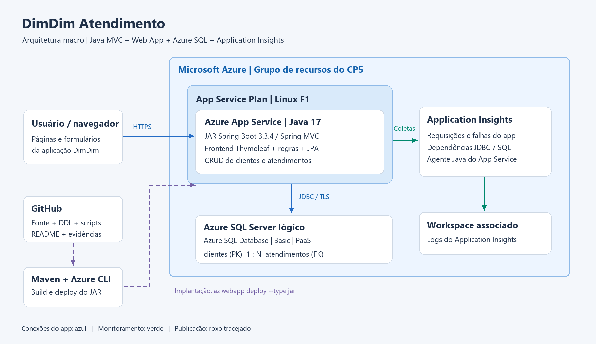

# DimDim Atendimento - CP5 DevOps

Aplicação web Java para organizar o cadastro de clientes e os atendimentos da DimDim. Cada atendimento pertence a um cliente. A equipe consulta os registros, atualiza informações e acompanha atendimentos abertos, em andamento e concluídos por formulários e páginas HTML.

## Situação da implantação

O deploy no Azure App Service e a persistência no Azure SQL ainda precisam ser executados e demonstrados. A gravação do vídeo e o PDF final dependem dessa implantação e dos links definitivos.

O build local passou com `mvn clean verify`: 28 testes sem falhas e JAR gerado. Os testes locais não comprovam persistência no Azure SQL nem coleta de telemetria no Application Insights.

Nesta etapa, o repositório e a documentação ficam prontos para publicação. A execução na Azure deve começar somente quando houver uma assinatura ativa com crédito disponível; nenhum recurso deve ser criado enquanto a assinatura estiver `Disabled`.

## How to: executar e demonstrar a solução

Este README é um guia amplo para qualquer pessoa que precise configurar, executar e avaliar a solução. Ele apresenta os pré-requisitos, a criação dos recursos, a aplicação do DDL, a configuração do banco, o deploy do JAR, o CRUD e as evidências de monitoramento. Os comandos são reproduzíveis e devem ser executados na ordem indicada no tutorial abaixo.

Antes de criar qualquer recurso, confirme que a assinatura Azure está com estado `Enabled`. Se estiver `Disabled`, interrompa a criação até a assinatura ser reativada ou substituída por uma assinatura autorizada.

- GitHub: https://github.com/marcusvilanova/checkPoint_05_Devops
- Aplicação Azure: inserir aqui a URL obtida após implantação.
- Vídeo: inserir aqui o link acessível ao professor após a gravação.

Os JSONs de GET/POST/PUT/DELETE são condicionais à entrega de uma API. Esta implementação usa exclusivamente páginas MVC e formulários; esse artefato não se aplica ao projeto atual.

## Integrantes

| Nome completo | RM |
| --- | --- |
| Bruno Ferreira | 563489 |
| Gabriel Robertoni Padilha | 566293 |
| Hebert Lopes do Santos | 563192 |
| Marcus Vinícius Vila Nova da Silva | 558771 |
| Nicolas Monteiro Ramiro | 562380 |

O nome do grupo deve ser definido antes da criação do PDF final.

## Solução e regras

| Objeto | Dados | Operações no frontend |
| --- | --- | --- |
| Cliente | Nome, e-mail e telefone | Cadastrar, listar/consultar, editar e excluir |
| Atendimento | Cliente, assunto, descrição, status e data de abertura | Cadastrar, listar/consultar, editar e excluir |

A relação é de um cliente para vários atendimentos, com chave estrangeira `atendimentos.cliente_id`. Um cliente com atendimentos não pode ser excluído: primeiro remova ou transfira seus atendimentos. A aplicação valida os campos no servidor. Os dados da demonstração devem ser fictícios.

## Arquitetura da solução



O navegador acessa o Azure App Service por HTTPS. O App Service executa o JAR Spring MVC e renderiza o frontend Thymeleaf. A aplicação persiste clientes e atendimentos no Azure SQL Database, por JDBC com criptografia. O agente Java do App Service envia requisições, falhas e dependências JDBC ao Application Insights. O workspace associado ao Insights é criado pelo próprio Azure durante a criação do componente.

O repositório contém o fonte e os scripts. Maven gera o JAR; Azure CLI cria/configura os recursos e `az webapp deploy --type jar` publica a aplicação. O desenho representa componentes e suas conexões, e não uma sequência de implantação.

## Tecnologias e limite de escopo

- Java 17, Spring Boot 3.3.4, Spring MVC, Thymeleaf, JPA, Bean Validation e Maven: stack do projeto MVC citado na Aula 14.
- Azure App Service Linux, plano F1 e deploy de JAR com Azure CLI: Aulas 13 e 14.
- Azure SQL Database Basic, SQL Server lógico, DDL e `Invoke-Sqlcmd`: Aula 15.
- Application Insights com agente Java do App Service: Aula 14.
- Driver JDBC Microsoft SQL Server: adaptação para o banco expressamente obrigatório no CP5.

A solução usa a alternativa **Azure CLI + az webapp deploy** autorizada pelo enunciado. O banco é PaaS; a implantação do CP5 não usa Docker, ACI ou um banco em container.

## Estrutura

```text
pom.xml                         Dependências e empacotamento JAR
src/main/java/                  Aplicação Java e regras
src/main/resources/templates/   Frontend Thymeleaf
src/main/resources/static/      CSS local
src/test/                       Testes automatizados
scripts/config.example.sh       Configuração sem credenciais
scripts/01-criar-recursos.sh     Recursos Azure e firewall
scripts/02-aplicar-ddl.ps1       DDL no Azure SQL
scripts/03-configurar-aplicacao.sh Banco e monitoramento do app
scripts/04-deploy.sh             Deploy automatizado do JAR
scripts/05-verificar-recursos.sh Verificação sem exibir segredos
scripts/ddl.sql                 Tabelas, relacionamento e índice
scripts/consultas-evidencias.sql Consultas para demonstrar persistência
docs/arquitetura.png             Desenho macro
docs/roteiro-video.md           Sequência completa das evidências
docs/relatorio-conferencia-cp5.md Conferência do enunciado e das penalidades
docs/integrantes.md             Nomes completos e RMs da equipe
```

## Mapa operacional dos scripts

Execute os scripts na ordem abaixo. Os scripts Bash devem ser rodados no Azure Cloud Shell Bash ou em um ambiente com Azure CLI autenticada. O script PowerShell deve ser rodado no Azure Cloud Shell PowerShell ou em um computador com o módulo `SqlServer` instalado.

| Ordem | Arquivo | Ambiente | Resultado comprovado |
| --- | --- | --- | --- |
| 0 | `config.example.sh` → `config.local.sh` | Bash | nomes, região, assinatura e IP do cliente SQL; sem credenciais |
| 1 | `01-criar-recursos.sh` | Bash | grupo, plano Linux F1, Web App Java 17, SQL Basic, firewall e Application Insights |
| 2 | `02-aplicar-ddl.ps1` | PowerShell | tabelas `clientes`, `atendimentos`, FK e índice no Azure SQL |
| 3 | `03-configurar-aplicacao.sh` | Bash | variáveis do Spring, conexão JDBC criptografada e agente do Insights |
| 4 | `04-deploy.sh` | Bash | JAR publicado com `az webapp deploy --type jar` |
| 5 | `05-verificar-recursos.sh` | Bash | estado e hostname dos recursos, sem exibir segredos |
| apoio | `consultas-evidencias.sql` | SQL | consultas para provar o banco, o relacionamento e as exclusões |

O procedimento de implantação está nas seções seguintes. A demonstração deve usar dados fictícios e manter credenciais fora do código, dos terminais e das gravações.

## Tutorial completo de implantação

### 1. Preparar as contas e ferramentas

Use a assinatura Azure da turma, com permissão para criar recursos e uma região permitida pelas políticas. O plano F1 é o usado em aula. O Azure SQL Basic e o monitoramento podem consumir créditos da assinatura; verifique no portal a disponibilidade e o orçamento. Se F1 não estiver disponível, verifique outra região permitida com o professor; os scripts não trocam automaticamente para um plano pago.

Na máquina que compila o projeto: Git, JDK 17 e Maven. No Azure Cloud Shell: Bash com Azure CLI e PowerShell com o módulo `SqlServer`, para `Invoke-Sqlcmd`, como na Aula 15. Também é possível executar Azure CLI e os mesmos scripts em uma máquina com essas ferramentas.

```bash
git clone URL_DO_NOVO_REPOSITORIO
cd NOME_DA_PASTA_CLONADA
java -version
mvn -version
mvn clean verify
```

O resultado da compilação deve ser `target/dimdim-atendimento-1.0.0.jar`. Os testes locais verificam o código; as evidências avaliadas devem mostrar a aplicação e o banco na Azure.

### 2. Configurar nomes e assinatura

No Cloud Shell Bash, clone o mesmo repositório e execute:

```bash
cp scripts/config.example.sh scripts/config.local.sh
```

Edite `scripts/config.local.sh`: informe a assinatura, a região permitida, o RM usado nos nomes e nomes globalmente únicos do Web App e do servidor SQL. Essa configuração é ignorada pelo Git. Ela não deve conter senha ou usuário SQL.

No terminal Bash da máquina local, caso necessário:

```bash
az login
```

No Cloud Shell, a sessão já é autenticada pelo portal. Os scripts selecionam a assinatura indicada na configuração. Não grave telas contendo senhas, tokens ou variáveis privadas.

### 3. Criar os recursos por Azure CLI

No Cloud Shell Bash, na raiz do repositório:

```bash
bash scripts/01-criar-recursos.sh
```

O script cria o grupo, o plano F1 Linux, o Web App Java 17, o SQL Server lógico, o banco Basic, as regras de firewall e o Application Insights. Quando solicitado, informe o usuário e a senha SQL de forma oculta. O firewall admite serviços Azure e somente o IP específico de demonstração informado na configuração; não libera toda a internet.

Confirme os recursos no portal e grave a execução para o vídeo. Não altere o runtime para Tomcat: o pacote é um JAR com servidor embutido.

### 4. Criar as tabelas no Azure SQL

Abra o Cloud Shell PowerShell na pasta do projeto. Informe os nomes definidos na configuração, substituindo os exemplos pelos seus nomes reais:

```powershell
Get-Command Invoke-Sqlcmd
./scripts/02-aplicar-ddl.ps1 -ServerName NOME_SERVIDOR_SQL -DatabaseName NOME_BANCO
```

O script solicita a credencial SQL e executa `scripts/ddl.sql`. Caso use SSMS para executar o mesmo arquivo, conecte ao servidor `NOME_SERVIDOR_SQL.database.windows.net`, selecione o banco e mantenha a criptografia habilitada.

Se o PowerShell usar um IP diferente do liberado na etapa 3, adicione **somente aquele IP** com `az sql server firewall-rule create`, conforme o comando da Aula 15. Nunca substitua isso por uma regra de todos os IPs.

Verifique `clientes`, `atendimentos` e a chave estrangeira no banco. A aplicação usa `ddl-auto=validate`: ela não cria ou altera o esquema em produção. O DDL deve estar aplicado antes de iniciar o app.

### 5. Configurar o banco e o Application Insights

Volte ao Cloud Shell Bash:

```bash
bash scripts/03-configurar-aplicacao.sh
```

Informe a mesma credencial SQL. O script configura `SPRING_DATASOURCE_URL`, `SPRING_DATASOURCE_USERNAME`, `SPRING_DATASOURCE_PASSWORD` e o agente do Application Insights. Os valores não são exibidos no console nem gravados no código. A URL JDBC usa `encrypt=true` e `trustServerCertificate=false`.

No portal, confira que o recurso Application Insights está associado ao Web App. Não filme a tela dos valores das variáveis de ambiente.

### 6. Publicar o JAR por Azure CLI

Há duas formas de disponibilizar o JAR ao terminal de deploy, sem mudar a técnica ensinada:

1. Compilar com `mvn clean verify` na própria sessão que contém JDK 17 e Maven.
2. Compilar na máquina local e enviar somente o JAR ao Cloud Shell. Crie a pasta `target` na raiz do projeto e coloque o arquivo nela.

Para compilar e publicar na mesma sessão:

```bash
bash scripts/04-deploy.sh
bash scripts/05-verificar-recursos.sh
```

Se o JAR foi compilado na máquina local e enviado ao Cloud Shell, use a opção de artefato já compilado:

```bash
bash scripts/04-deploy.sh --jar target/dimdim-atendimento-1.0.0.jar
bash scripts/05-verificar-recursos.sh
```

Nesse segundo caminho, a sessão de deploy precisa de Azure CLI, mas não de Maven ou Java.

O deploy usa `az webapp deploy --type jar`, conforme a Aula 13. A URL é obtida do hostname real do Web App; abra essa URL com HTTPS. Aguarde a inicialização antes de testar.

Se houver falha, consulte o diagnóstico do App Service e os logs. Não prossiga para a gravação de CRUD enquanto o aplicativo estiver indisponível. Erros de firewall, credencial e esquema precisam ser resolvidos no banco/configuração, sem desativar a validação do JPA.

### 7. Validar a aplicação e a persistência

Abra a aplicação pela URL pública do Azure App Service. As páginas principais são `/`, `/clientes` e `/atendimentos`; os formulários permitem criar, consultar, editar e excluir os dois tipos de registro.

Use `scripts/consultas-evidencias.sql` para consultar o banco depois das operações. A consulta deve confirmar os dados persistidos nas duas tabelas, a relação por `cliente_id` e a remoção dos registros excluídos. A chave estrangeira exige que os atendimentos sejam removidos antes do cliente relacionado.

Para a avaliação, todas as operações CRUD devem ser executadas pelo frontend publicado e conferidas no Azure SQL. A sequência detalhada de demonstração e gravação fica no material operacional separado da equipe.

### 8. Validar o monitoramento

Abra o recurso Application Insights associado ao Web App e selecione um intervalo que inclua as requisições realizadas. Confirme a existência de requisições do aplicativo e de dependências SQL associadas às transações.

As coletas podem levar alguns minutos. Gere novas requisições no aplicativo e atualize o intervalo quando necessário. A existência do recurso, sem dados coletados, não comprova o monitoramento.

### 9. Artefatos de entrega

O GitHub deve conter o fonte, os scripts, o DDL, o desenho da arquitetura e este How to. Complete no início deste arquivo os links da aplicação Azure e do vídeo quando a implantação e a gravação estiverem concluídas.

O PDF final deve seguir a nomenclatura `<nome_grupo>_webapp.pdf` e conter somente nome do grupo, nomes completos/RMs e links do GitHub e do vídeo. O representante deve enviar somente esse PDF no Teams; não envie ZIP, TXT ou o repositório de código como anexo.

## Verificação antes da entrega

- [ ] Aplicação acessível pela URL pública do Azure App Service.
- [ ] Tabelas e chave estrangeira criadas no Azure SQL.
- [ ] CRUD das duas tabelas funcionando, com consulta SQL após cada operação.
- [ ] Application Insights exibindo requisições e dependências SQL reais.
- [ ] Repositório com fonte, DDL, scripts, arquitetura e tutorial completo.
- [ ] Vídeo narrado em pelo menos 720p, com criação dos recursos e deploy.
- [ ] Links do GitHub e do vídeo acessíveis ao professor.
- [ ] PDF com nome do grupo, nomes/RMs e links, na nomenclatura exigida.

Marque os itens somente após conferir sua execução e respectivas evidências.

## Onde cada requisito aparece

| Requisito do CP5 | Evidência no projeto |
| --- | --- |
| Aplicação Java na nuvem | `pom.xml`, `src/`, runtime Java 17 e JAR publicado no App Service |
| Banco Azure SQL obrigatório | `scripts/01-criar-recursos.sh`, `scripts/02-aplicar-ddl.ps1` e `scripts/ddl.sql` |
| Relacionamento entre tabelas | FK `FK_atendimentos_clientes`, índice por `cliente_id` e tela de detalhe do cliente |
| CRUD completo | formulários MVC em `src/main/resources/templates/`, controllers, services e consultas de evidência |
| Monitoramento | `scripts/03-configurar-aplicacao.sh`, agente Java e consultas no Application Insights |
| Reprodutibilidade | configuração sem credenciais, scripts idempotentes e deploy por Azure CLI |
| Evidência para avaliação | vídeo narrado, consultas SQL após cada operação e PDF com links definitivos |

## Referências de implementação

As aulas fornecidas são a referência principal. As páginas oficiais abaixo servem para conferir a sintaxe atual dos mesmos serviços:

- [Exemplo MVC citado pelo professor na Aula 14](https://github.com/profjoaomenk/playmix-mvc) - referência de stack, sem copiar o domínio.
- [Azure CLI: Web App deploy](https://learn.microsoft.com/en-us/cli/azure/webapp#az-webapp-deploy).
- [Application Insights no App Service Java](https://learn.microsoft.com/en-us/azure/app-service/monitor-app-service).
- [Azure CLI: Application Insights component](https://learn.microsoft.com/en-us/cli/azure/monitor/app-insights/component).
